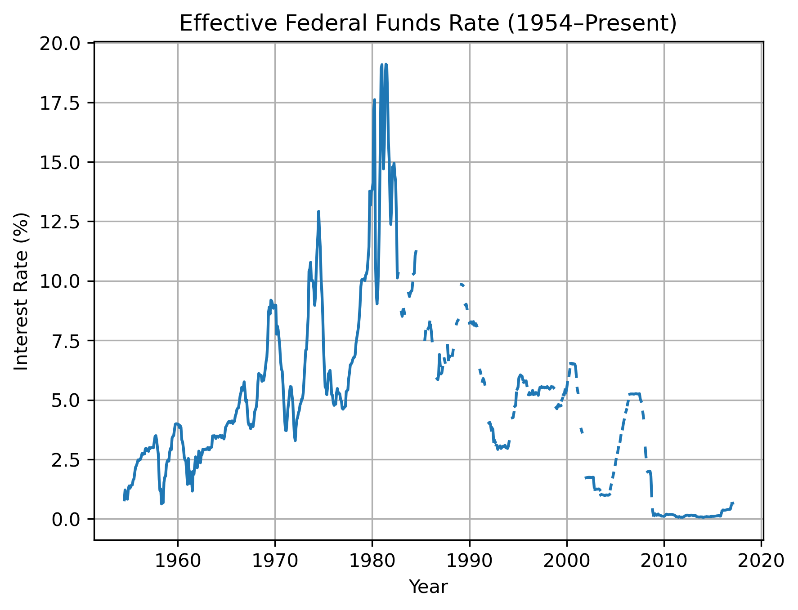
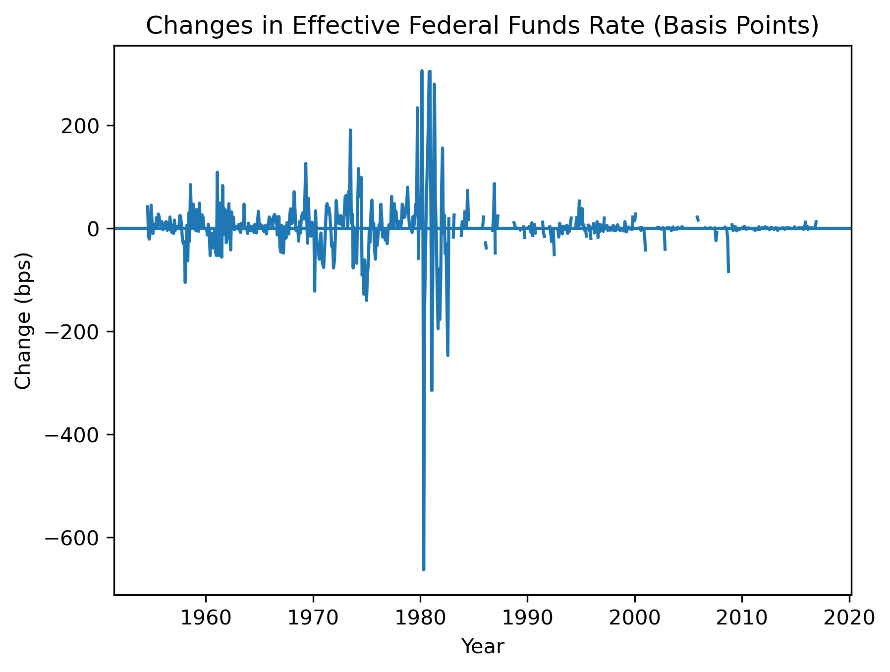

# U.S. Federal Funds Rate Analysis (1954–Present)

## Overview
This project analyzes the historical behavior of the U.S. **Effective Federal Funds Rate** from 1954 to the present, with a focus on **rate changes rather than levels** to better capture Federal Reserve policy actions. Using time-series analysis and macroeconomic indicators, the project examines monetary tightening and easing cycles and their relationship with unemployment and inflation.

The goal of this analysis is to provide an intuitive, data-driven view of how U.S. monetary policy evolves over time and how it responds to broader economic conditions.

---
## Visual Highlights

### Federal Funds Rate Over Time


Long-term evolution of the effective federal funds rate, highlighting major monetary policy regimes.

---

### Changes in the Federal Funds Rate (Basis Points)


Rate changes provide a clearer view of Federal Reserve policy actions and tightening/easing cycles.

---

### Rate Changes vs Inflation


Periods of elevated inflation are associated with larger and more frequent rate adjustments.


---


## Key Questions
- How has the Federal Funds Rate evolved over time?
- When has the Federal Reserve been tightening vs easing policy?
- How large and frequent are rate changes?
- How do rate changes relate to unemployment and inflation?

---

## Key Insights
- Federal Reserve policy actions are better understood through **rate changes** rather than absolute rate levels.
- Periods of tightening and easing occur in **distinct cycles**, often aligned with macroeconomic stress.
- Larger rate changes tend to cluster during periods of elevated inflation or economic instability.
- The relationship between rate changes and unemployment/inflation is **non-linear**, highlighting the complexity of monetary policy decisions.

---

## Methods
- Time-series visualization of interest rate levels and changes  
- First-difference transformation to measure rate changes (basis points)  
- Rolling averages to smooth volatility and identify policy cycles  
- Automatic classification of **tightening**, **easing**, and **neutral** periods  
- Scatter analysis comparing rate changes to unemployment and inflation  

---

## Tools & Technologies
- Python  
- pandas  
- matplotlib  
- Jupyter Notebook  

---

## Project Structure
``` federal-interest-rate-analysis/ ├─ data/ │ └─ interest_rates.csv ├─ images/ │ ├─ rate_levels_over_time.png │ ├─ rate_changes_over_time.png │ └─ rate_vs_inflation.png ├─ federal-funds-rate-analysis-1954-present.ipynb └─ README.md ```

---

## Data Source
- Kaggle: *U.S. Federal Funds Rate and Macroeconomic Indicators*

---

## How to Run
1. Clone the repository
2. Open the Jupyter notebook
3. Run all cells — no additional configuration required

---

## Why This Project
This project was completed as a **personal portfolio analysis** to demonstrate:
- Time-series data analysis skills
- Economic reasoning and interpretation
- Reproducible research practices
- Clean, professional GitHub project structure
