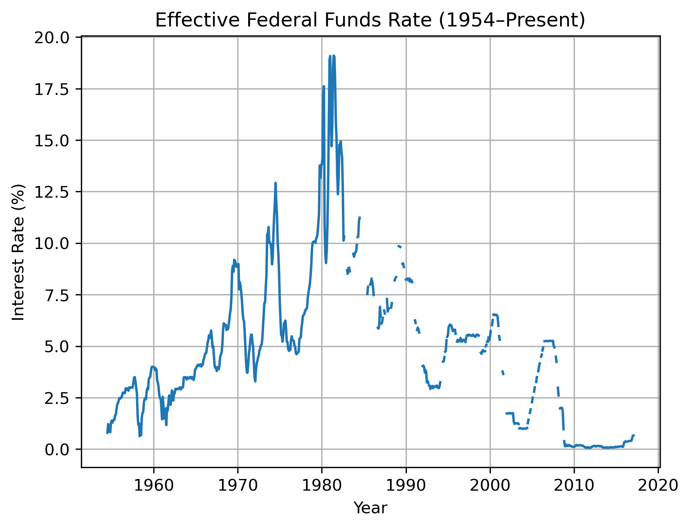
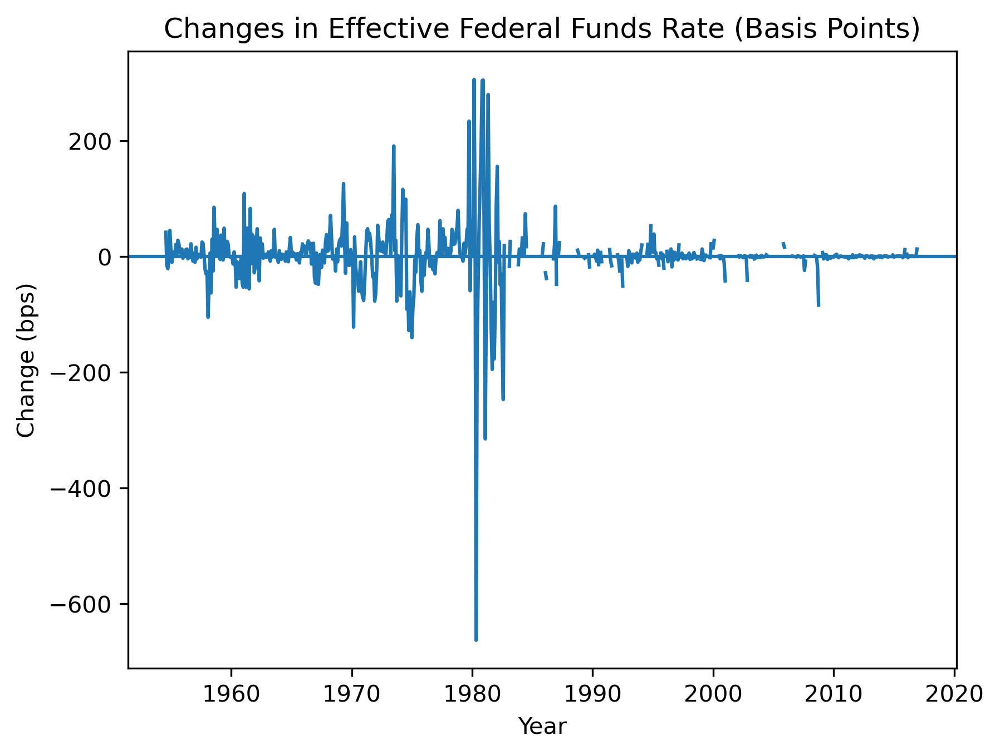
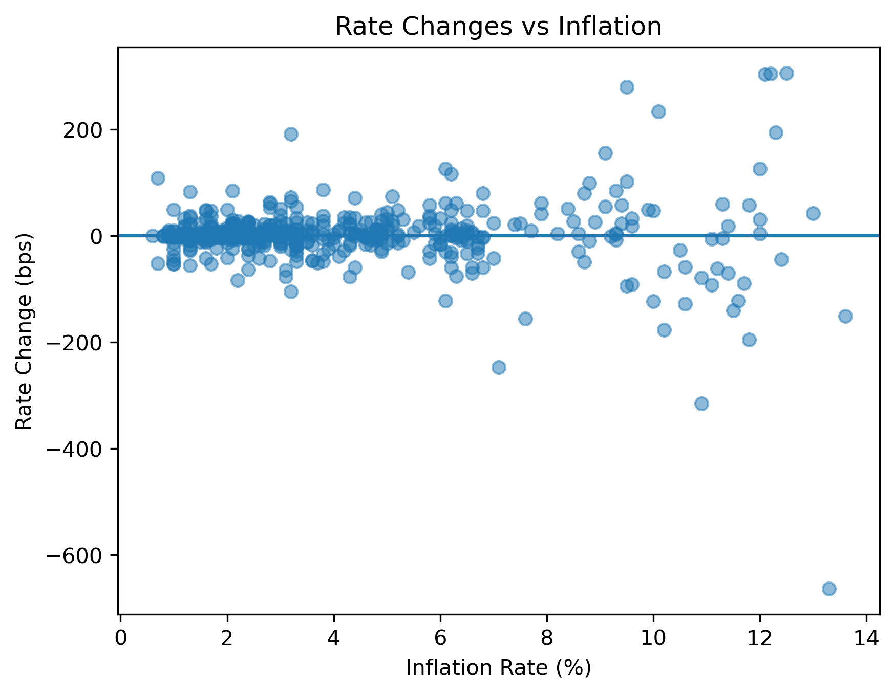

# 📊 U.S. Federal Funds Rate Analysis (1954–Present)


## 🧠 Executive Summary

This project analyzes the U.S. Effective Federal Funds Rate from 1954 to the present, focusing on **rate changes (policy actions)** rather than static rate levels.

### 🔍 Key Findings

* **Rate changes reveal policy cycles** more clearly than rate levels alone
* **Volatility clusters during economic stress periods**, particularly during inflationary regimes
* The relationship between **interest rate changes, inflation, and unemployment is non-linear** and context-dependent

## 💼 Business Relevance

Understanding how interest rates evolve across economic cycles is critical for:

* 📉 Interpreting lending and borrowing conditions
* 📈 Assessing inflation response strategies
* 👩‍💼 Evaluating labor market pressure
* ⚠️ Anticipating macroeconomic risk

## 🎯 Project Objective

To analyze long-term Federal Reserve behavior by:

* Identifying patterns in **interest rate movements**
* Highlighting **policy tightening and easing cycles**
* Exploring relationships with **inflation and unemployment**

---

## 📈 Visual Analysis

### 📌 Federal Funds Rate Over Time



**Takeaway:**
Long-run rate levels highlight broad monetary regimes, but they do not fully capture the timing or intensity of policy actions.

---

### 📌 Changes in the Federal Funds Rate



**Takeaway:**
Monthly rate changes reveal **policy inflection points and volatility** much more clearly than absolute rate levels.

---

### 📌 Rate Changes vs Inflation



**Takeaway:**
Higher inflation periods tend to coincide with **larger and more frequent rate adjustments**, though the relationship is noisy and not strictly linear.

---

## 🛠️ Analytical Approach

### 🔹 Data Preparation

* Combined Year, Month, and Day into a unified **datetime variable**
* Set time index for time-series analysis
* Filtered to relevant economic indicators

### 🔹 Feature Engineering

* Calculated **monthly rate changes (first differences)**
* Applied **rolling averages** to smooth volatility
* Classified periods as:

  * 🔺 Tightening
  * 🔻 Easing
  * ➖ Neutral

### 🔹 Exploratory Analysis

* Time-series trend analysis
* Distribution and volatility analysis
* Relationship exploration with inflation and unemployment

---

## 📦 Project Structure

```text
federal-interest-rate-analysis/
├── data/
│   └── interest_rates.csv
├── images/
│   ├── rate_levels_over_time.png
│   ├── rate_changes_over_time.png
│   ├── rate_change_vs_inflation.png
│   └── repo_banner.png
├── notebooks/
│   └── federal-funds-rate-analysis-1954-present.ipynb
├── reports/
│   └── summary_report.md
├── data_dictionary.md
├── requirements.txt
├── README.md
└── .gitignore
```

---

## 📊 Key Insights

* 📉 **Rate levels alone are insufficient** for understanding policy behavior
* ⚡ **Rate changes capture real-time policy decisions** more effectively
* 🔄 **Policy volatility aligns with macroeconomic stress periods**
* 🔗 Relationships with inflation and unemployment exist but are **non-linear and complex**

---

## ⚠️ Limitations

* This analysis is **exploratory, not causal**
* Some macroeconomic variables contain **missing values in earlier periods**
* Monthly granularity may not capture **intra-period policy shifts**
* External macro factors are not fully modeled

---

## 🚀 Next Steps

* Add **policy-era annotations** (e.g., Volcker era, financial crisis)
* Incorporate **recession shading**
* Build **statistical or predictive models**
* Expand into a **dashboard or interactive visualization**

---

## ⚙️ Tools & Technologies

* 🐍 Python
* 🐼 pandas
* 🔢 NumPy
* 📊 Matplotlib
* 📓 Jupyter Notebook

---

## ▶️ How to Run

```bash
git clone https://github.com/cfoybowman/federal-interest-rate-analysis.git
cd federal-interest-rate-analysis
pip install -r requirements.txt
jupyter notebook
```

---

## 📚 Data Source

* Federal Reserve Economic Data (FRED)

---

## ✨ Why This Project Matters

This project demonstrates:

* 📊 Time-series analysis and feature engineering
* 🧠 Analytical thinking and interpretation of macroeconomic data
* 📁 Structured, reproducible project design
* 📈 Ability to translate data into meaningful insights

---

## 👤 Author

**Christina Foy-Bowman**
Aspiring Data Analyst | MS in Data Analytics (In Progress)
